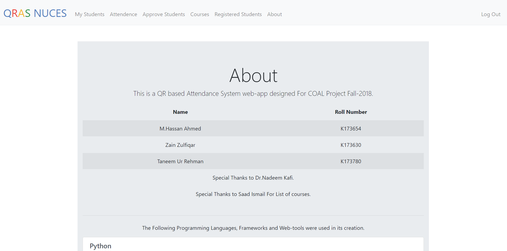
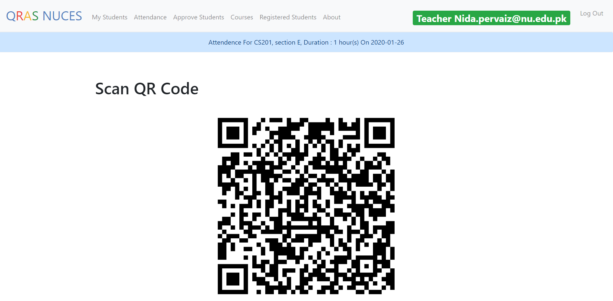
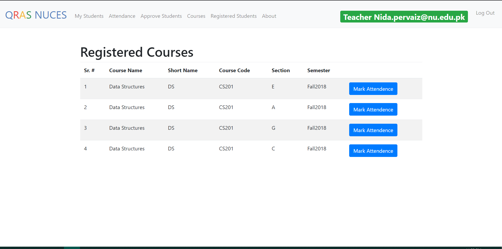
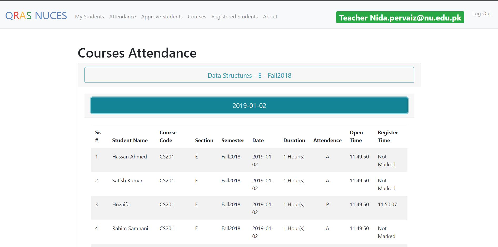
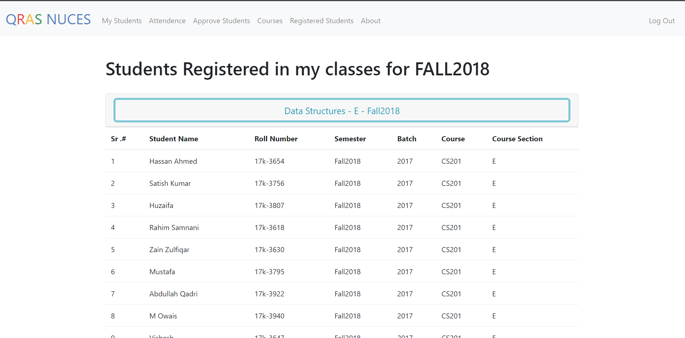
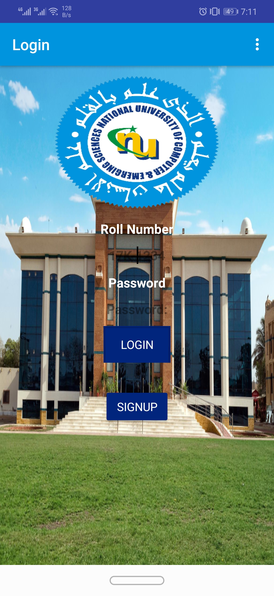
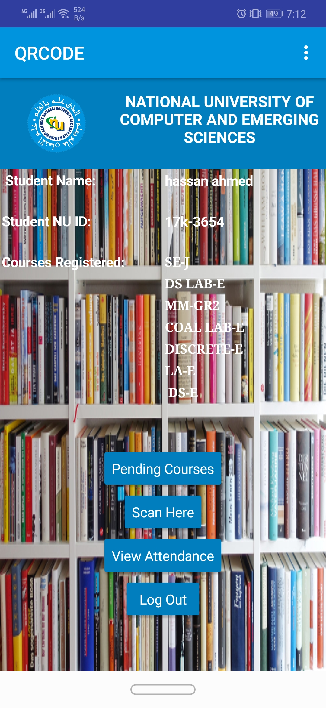

# QRAS

QR based Attendance system that consists of an online portal separate for teachers and students.

Students can register themselves on the portal and will be approved by their respective teachers.

QR code can be generated by the teacher which will be scanned by the students using the MIT-App inventor android app to mark their attendance.

Portal : [Click Here To Open QRAS Portal - www.qras.ml](www.qras.ml)

## Screenshots:
- 
- 
- 
- 
- 

|      |  |
| ----------- | ----------- |
